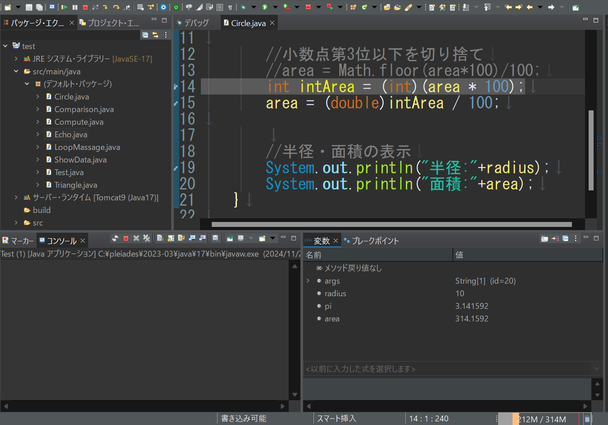

# Eclipseのデバッグ方法

1.  最上部メニューの`ウィンドウ` => `ビューの表示`
2.  `ブレイクポイント`と`変数`を選択
3.  プログラムを一時停止させたい行数をダブルクリックすると、ブレイクポイントが追加される
4.  もう一度同じ行をダブルクリックすると、ブレイクポイントが削除される
5.  この状態でプログラムを実行すると、ブレイクポイントで処理が止まり、`変数`のウィンドウから、停止した時の変数の状態を確認できる  
      
    なお、ブレイクポイントは複数登録でき、メニューの`実行`\=>`再開`でプログラムを再開させると、停止したところから次のブレイクポイントで停止する  
    ブレイクポイントで停止している状態で`ステップオーバー`を行うと、次の行の命令だけ実行され、ブレイクポイントと同様に変数の状態などを確認できる