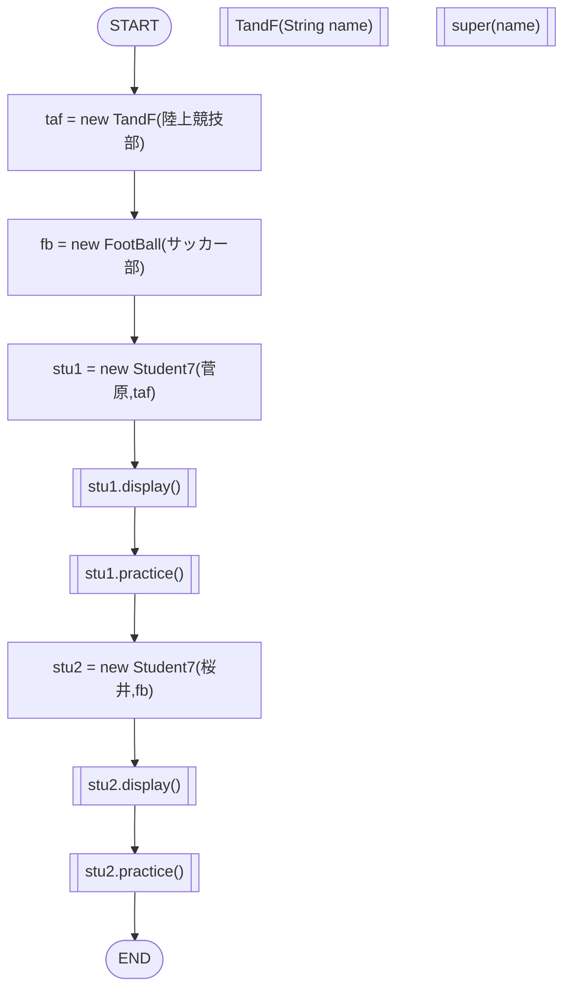
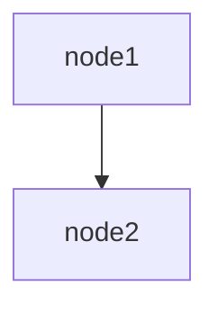

```mermaid
flowchart TB
    st([START])
    en([END])
    id1["taf = new TandF(陸上競技部)"]
    id2["fb = new FootBall(サッカー部)"]
    id3["stu1 = new Student7(菅原,taf)"]
    id4[["stu1.display()"]]
    id5[["stu1.practice()"]]
    id8["stu2 = new Student7(桜井,fb)"]
    id6[["stu2.display()"]]
    id7[["stu2.practice()"]]
    
    tandf[["TandF(String name)"]]
    t1[["super(name)"]]
    

    st --> id1
    id1 --> id2 --> id3 --> id4 --> id5
    id5 --> id8 --> id6 --> id7
    id7 --> en
```

```mermaid
flowchart
    id1[node1]
    id2[node2]
    id1 --> id2

```